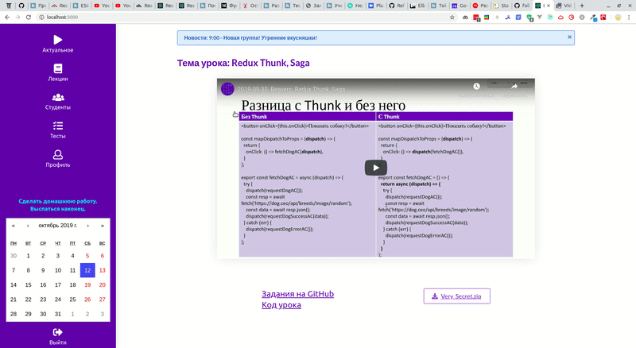

# Learning Management System

Система управления обучением. Видео, задания, файлы для обучения - все в одном месте. Важные события всегда видны в календаре. Система управления группами и материалами для администратора.

# MVP функционал:

- Аутентификация пользователя.
- Встраивание видео с YouTube, добавление файлов и ссылок для урока.
- Обработка информации из Google Calendar , вывод в компоненте на главной странице по дням.
- Просмотр всех обучающих материалов для заданной группы с фильтром.
- Подробный просмотр обучающего материалы конкретного дня.
- Просмотр всех студентов с возможностью фильтрации по группе.
- Встраивание тестов, загруженных из Google Forms.
- Просмотр и редактирование профиля.
- Просмотр всех обучающих материалов для всех групп с фильтром (функционал администратора).
- Возможность изменять обучающий материал конкретного дня (функционал администратора).
- Возможность добавлять Фазу/Неделю/День обучения для заданной группы (функционал администратора).
- Возможность фильтровать студентов по группе, изменять группу студентам, добавление новой группы (функционал администратора).
- Возможность фильтровать тесты по группе, изменять и создавать новые по Google Form ссылке.

## Технологии

**Node.js, Express.js, Passport.js, React, Thunk, Redux, MongoDB, Webpack, Babel, Semantic ui. API(Google Calendar).**

## Авторы

- [Олег Матюнин](https://github.com/Oleg-Mat)
- [Фёкла Волобуева](https://github.com/RabbitWithoutaHat/)
- [Шамиль Гаджиев](https://github.com/shimunic)
